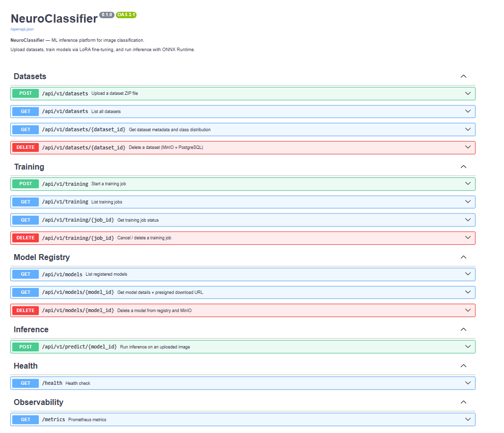
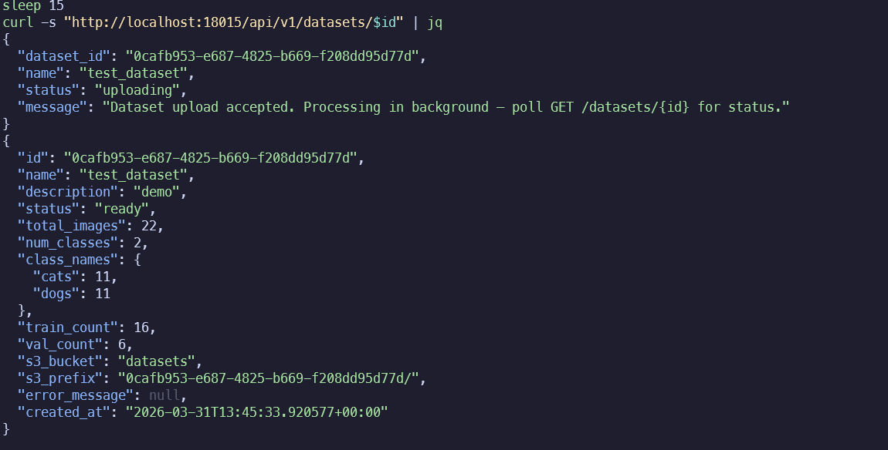
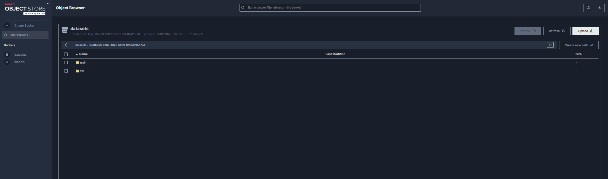

# NeuroClassifier

[](https://github.com/sayomiyori/NeuroClassifier/actions)
[](#)
[](#)
[](#)
[](#)
[](#)
[](#)
[](#)
[](#)
[](#)
[](#)
[](LICENSE)

ML inference platform: upload a labelled dataset → **LoRA fine-tune** a vision transformer in the background → serve predictions via **ONNX Runtime** — all through a single REST API. Async training via Celery, model registry in MinIO (S3), Prometheus + Grafana monitoring.

## Architecture

```
┌─────────────┐  upload / predict  ┌──────────────────────┐
│ Client      │ ──────────────────▶│ FastAPI (port 18015) │
└─────────────┘                    └──────┬───────────────┘
                                          │ enqueue task
                                   ┌──────▼───────────────┐
                                   │ Redis (Celery broker) │
                                   └──────┬───────────────┘
                                          │ train / infer
                                   ┌──────▼───────────────┐
                                   │ Celery Worker        │
                                   │ LoRA fine-tune       │
                                   │ ONNX export          │
                                   │ batch inference      │
                                   └──────┬───────────────┘
                                          │ store artefacts
                              ┌───────────▼───────────────┐
                              │ MinIO (S3-compatible)      │
                              │ datasets/ · models/        │
                              └───────────────────────────┘
                                          │
                              ┌───────────▼───────────────┐
                              │ PostgreSQL — metadata      │
                              └───────────────────────────┘

  Observability: FastAPI → /metrics → Prometheus → Grafana
```

## Screenshots

### Swagger UI


### Dataset List


### MinIO — datasets bucket


## Tech Stack

| Layer | Technology |
|-------|-----------|
| API | FastAPI + Uvicorn |
| Task queue | Celery + Redis |
| Object storage | MinIO (S3-compatible) |
| Database | PostgreSQL + SQLAlchemy (async) |
| Training | PyTorch + HuggingFace Transformers + PEFT (LoRA) |
| Inference | ONNX Runtime |
| Monitoring | Prometheus + Grafana |
| CI | GitHub Actions (ruff + pytest + Docker build) |

## Architecture Decisions

**LoRA over full fine-tuning** — trains only ~1% of model parameters (query + value projections). Converges in minutes on CPU, no GPU required for small datasets. Makes the project runnable by anyone without cloud GPU.

**ONNX Runtime for inference** — 3–5x faster than PyTorch `model.forward()`, no PyTorch dependency at serve-time. The worker exports a merged (LoRA-unloaded) ONNX graph after training.

**MinIO for model storage** — S3-compatible object store in Docker. Versioned adapter weights and ONNX artefacts stored side-by-side, making rollback trivial.

**Celery for training and batch inference** — keeps the API non-blocking. Training jobs run for minutes/hours; the API returns a `job_id` immediately and the client polls for status.

## Quick Start

```bash
git clone https://github.com/sayomiyori/NeuroClassifier.git
cd NeuroClassifier
docker compose up -d
```

| Service | URL |
|---------|-----|
| API + Swagger | `http://localhost:18015/docs` |
| Health | `http://localhost:18015/health` |
| MinIO console | `http://localhost:29001` (admin / minioadmin) |
| Flower (tasks) | `http://localhost:15555` |
| Prometheus | `http://localhost:19090` |
| Grafana | `http://localhost:13000` (admin / admin) |

## API

### Datasets

```bash
# Upload labelled ZIP (class_name/image.jpg structure)
curl -X POST http://localhost:18015/api/v1/datasets \
  -F "name=cats_vs_dogs" -F "file=@dataset.zip"

# List datasets
curl http://localhost:18015/api/v1/datasets | jq

# Get dataset details
curl http://localhost:18015/api/v1/datasets/<id> | jq

# Delete dataset
curl -X DELETE http://localhost:18015/api/v1/datasets/<id>
```

### Training

```bash
# Start LoRA fine-tuning
curl -X POST http://localhost:18015/api/v1/train \
  -H "Content-Type: application/json" \
  -d '{
    "dataset_id": "<uuid>",
    "base_model": "google/vit-base-patch16-224",
    "epochs": 5,
    "batch_size": 8,
    "learning_rate": 1e-4,
    "lora_rank": 8
  }' | jq

# Poll job status
curl http://localhost:18015/api/v1/train/<job_id> | jq

# Learning curve (metrics per epoch)
curl http://localhost:18015/api/v1/models/<model_id>/metrics | jq
```

### Inference

```bash
# Single image prediction
curl -X POST http://localhost:18015/api/v1/predict \
  -F "model_id=<uuid>" \
  -F "file=@cat.jpg" | jq
# {"predictions":[{"class_name":"cat","confidence":0.97}],"latency_ms":12.4}

# Batch (ZIP of images) — async
curl -X POST http://localhost:18015/api/v1/predict/batch \
  -F "model_id=<uuid>" \
  -F "file=@images.zip" | jq
# {"job_id":"...","status":"processing"}

# Poll batch results
curl http://localhost:18015/api/v1/predict/batch/<job_id> | jq
# {"status":"completed","results_url":"http://...presigned..."}
```

### Metrics

```bash
curl http://localhost:18015/metrics | grep -E "train_duration|inference_latency|predictions_total"
```

## Prometheus Metrics

| Metric | Type | Description |
|--------|------|-------------|
| `train_duration_seconds` | Histogram | Training job duration |
| `inference_latency_seconds` | Histogram | ONNX Runtime inference latency |
| `models_trained_total` | Counter | Total training jobs completed |
| `predictions_total` | Counter | Predictions; labels: `model_id`, `class` |
| `datasets_total` | Gauge | Active datasets |
| `active_training_jobs` | Gauge | Currently running training jobs |

## Monitoring

Grafana dashboard at `http://localhost:13000` includes:

- **Training** — jobs over time, avg duration, active jobs
- **Inference** — latency p50/p95/p99, RPS by model, predictions by class
- **HTTP** — request rate and latency by endpoint

## Running Tests

```bash
python -m venv .venv && source .venv/bin/activate
pip install -r requirements.txt
pytest tests/ -v --cov=app
ruff check app/
```

## Project Structure

```
neuroclassifier/
├── app/
│   ├── api/v1/          # datasets, training, models, predict endpoints
│   ├── models/          # SQLAlchemy: Dataset, TrainingJob, MLModel
│   ├── services/        # dataset_service, inference (ONNX Runtime)
│   ├── workers/         # Celery: train_worker (LoRA + ONNX export)
│   └── metrics.py       # Prometheus metrics
├── grafana/             # Dashboard provisioning
├── docs/images/         # Screenshots
├── docker-compose.yml
├── Dockerfile
├── Dockerfile.worker
├── prometheus.yml
└── requirements.txt
```

## License

MIT — see [LICENSE](LICENSE).
